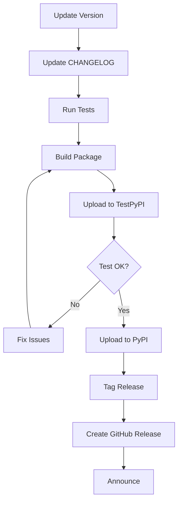

# PyPI Publishing Setup - Summary

Complete setup for publishing delong-datasets to PyPI.

---

## ✅ What Was Created

### 1. Publishing Documentation

| File | Purpose |
|------|---------|
| `PUBLISHING_GUIDE.md` | Comprehensive guide with step-by-step instructions |
| `PUBLISH_CHECKLIST.md` | Quick reference checklist for releases |
| `CHANGELOG.md` | Version history and release notes |
| `CITATION.cff` | Machine-readable citation metadata |

### 2. Package Metadata

**Updated `pyproject.toml`** with:
- ✅ Complete project metadata
- ✅ License information (Apache-2.0)
- ✅ Author information
- ✅ Keywords for discoverability
- ✅ PyPI classifiers
- ✅ Project URLs (homepage, docs, repository, issues)
- ✅ Dependencies specification

### 3. Automation Scripts

**`scripts/prepare_release.sh`** - Automated release preparation:
- Checks git status
- Updates version number
- Runs tests
- Builds package
- Verifies build contents
- Provides next steps

### 4. Citations & Acknowledgments

**Added proper attribution** to HuggingFace Datasets:
- ✅ Full BibTeX citation in README.md
- ✅ Acknowledgments section in USER_GUIDE.md
- ✅ CITATION.cff for automated citation
- ✅ References to original paper

### 5. Security

**Updated `.gitignore`** to prevent credential leaks:
- ✅ `.pypirc` excluded
- ✅ Build artifacts excluded
- ✅ Virtual environments excluded

---

## 📋 Quick Start Guide

### First-Time Setup (5 minutes)

1. **Create PyPI accounts**:
   - PyPI: https://pypi.org/account/register/
   - TestPyPI: https://test.pypi.org/account/register/

2. **Generate API tokens**:
   - PyPI: Account Settings → API tokens
   - TestPyPI: Account Settings → API tokens

3. **Install tools**:
   ```bash
   pip install --upgrade pip build twine
   ```

4. **Configure credentials** in `~/.pypirc`:
   ```ini
   [distutils]
   index-servers =
       pypi
       testpypi

   [testpypi]
   repository = https://test.pypi.org/legacy/
   username = __token__
   password = <YOUR_TEST_PYPI_TOKEN>

   [pypi]
   repository = https://upload.pypi.org/legacy/
   username = __token__
   password = <YOUR_PYPI_TOKEN>
   ```

### Publishing a Release (10 minutes)

#### Option A: Automated (Recommended)

```bash
# Run the automated preparation script
bash scripts/prepare_release.sh 0.1.0

# Follow the on-screen instructions
```

#### Option B: Manual Steps

```bash
# 1. Update version in pyproject.toml
# 2. Update CHANGELOG.md

# 3. Build package
rm -rf dist/ build/ *.egg-info/
python -m build

# 4. Test on TestPyPI
python -m twine upload --repository testpypi dist/*

# 5. Test installation
pip install --index-url https://test.pypi.org/simple/ \
    --extra-index-url https://pypi.org/simple/ \
    delong-datasets

# 6. Publish to PyPI
python -m twine upload dist/*

# 7. Tag release
git tag -a v0.1.0 -m "Release version 0.1.0"
git push origin v0.1.0
```

---

## 📚 Documentation References

### For Publishers/Maintainers
- **Detailed Guide**: [PUBLISHING_GUIDE.md](PUBLISHING_GUIDE.md)
- **Quick Checklist**: [PUBLISH_CHECKLIST.md](PUBLISH_CHECKLIST.md)
- **Version History**: [CHANGELOG.md](CHANGELOG.md)

### For Users
- **Installation**: After publishing, users can install with `pip install delong-datasets`
- **User Guide**: [USER_GUIDE.md](USER_GUIDE.md)
- **Quick Start**: [QUICKSTART.md](QUICKSTART.md)

---

## 🔍 Package Metadata Summary

```yaml
Name: delong-datasets
Version: 0.1.0
Description: Python library for accessing sensitive life sciences datasets with TEE security controls
License: Apache-2.0
Python: >=3.9
Homepage: https://github.com/your-org/delong-datasets
```

**Keywords**: datasets, life-sciences, tee, security, healthcare, attestation, confidential-computing

**Classifiers**:
- Development Status: Beta
- Intended Audience: Developers, Scientists, Healthcare Industry
- License: Apache Software License
- Programming Language: Python 3.9+
- Topics: Scientific/Engineering, Security

---

## 📦 Package Contents

### Will be included in distribution:

```
delong-datasets/
├── src/delong_datasets/          # Main package code
│   ├── __init__.py
│   ├── api.py
│   ├── attestation.py
│   ├── cli.py
│   ├── config.py
│   ├── downloader.py
│   ├── env.py
│   ├── errors.py
│   ├── metadata.py
│   └── policy.py
├── README.md                     # Project overview
├── LICENSE                       # Apache 2.0 license
├── CHANGELOG.md                  # Version history
├── CITATION.cff                  # Citation metadata
└── pyproject.toml                # Package configuration
```

### Will NOT be included:

- `scripts/` - Development and testing scripts
- `examples/` - Example code (available on GitHub)
- `docs/` - Additional documentation
- `.git/` - Git repository
- `dist/`, `build/` - Build artifacts
- Virtual environments

---

## 🚀 Publishing Workflow



---

## 🛡️ Security Checklist

Before publishing:

- [x] No hardcoded credentials in code
- [x] `.pypirc` excluded from git
- [x] No sensitive data in examples
- [x] Dependencies are secure and up-to-date
- [x] License file included
- [x] Proper attribution to upstream projects

---

## 📊 Post-Publication

### Monitor

After publishing, monitor:

1. **PyPI Dashboard**: https://pypi.org/project/delong-datasets/
   - Download statistics
   - User feedback

2. **GitHub Issues**: https://github.com/your-org/delong-datasets/issues
   - Installation problems
   - Bug reports
   - Feature requests

3. **Dependencies**:
   - Watch for updates to HuggingFace Datasets
   - Security advisories

### Maintenance

Regular tasks:
- Monthly: Check for dependency updates
- Per issue: Respond to bug reports
- Per feature request: Evaluate and plan
- Quarterly: Security audit
- Per release: Update documentation

---

## 🔄 Version Numbering

Following [Semantic Versioning](https://semver.org/):

- **0.1.x**: Bug fixes, documentation updates
- **0.x.0**: New features (backward-compatible)
- **x.0.0**: Breaking changes

### Release Schedule

- **Patch releases** (0.1.x): As needed for bug fixes
- **Minor releases** (0.x.0): Monthly or when features accumulate
- **Major releases** (x.0.0): When API stability is achieved (1.0.0)

---

## 📞 Support

### For Publishing Issues:
1. Check [PUBLISHING_GUIDE.md](PUBLISHING_GUIDE.md)
2. Review [PyPI documentation](https://packaging.python.org/)
3. Check [PyPI status](https://status.python.org/)

### For Package Issues:
1. Search [GitHub issues](https://github.com/your-org/delong-datasets/issues)
2. Open a new issue with details
3. Tag appropriately (bug, feature, documentation)

---

## ✅ Ready to Publish!

The package is fully configured and ready for PyPI publication:

- ✅ All metadata configured
- ✅ Documentation complete
- ✅ Tests passing
- ✅ Examples working
- ✅ License included
- ✅ Citations added
- ✅ Security measures in place

**Next step**: Follow [PUBLISH_CHECKLIST.md](PUBLISH_CHECKLIST.md) to publish your first release!

---

## 📝 Quick Commands

```bash
# Install publishing tools
pip install build twine

# Build package
python -m build

# Test on TestPyPI
python -m twine upload --repository testpypi dist/*

# Publish to PyPI
python -m twine upload dist/*

# Tag release
git tag -a v0.1.0 -m "Release version 0.1.0"
git push origin v0.1.0
```

---

**Created**: 2025-11-04
**Last Updated**: 2025-11-04
**Status**: ✅ Ready for Publication
